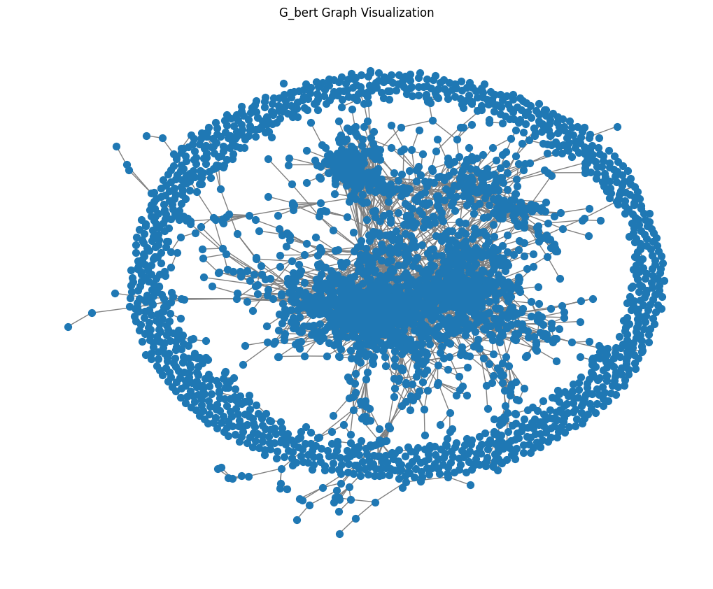
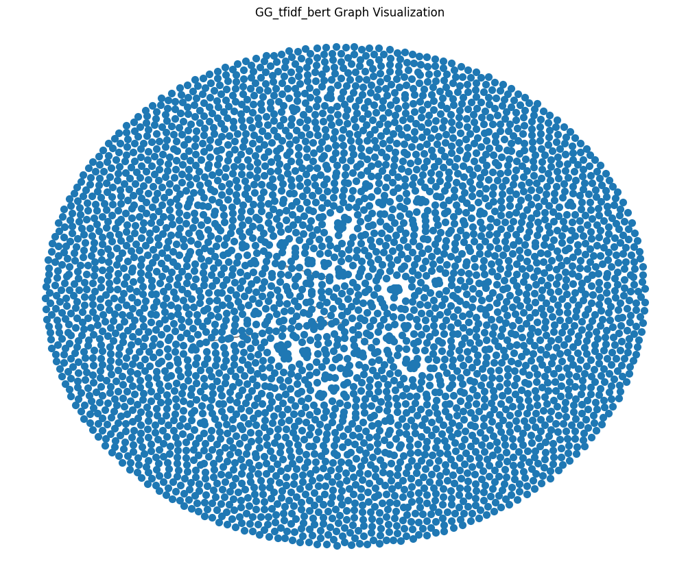
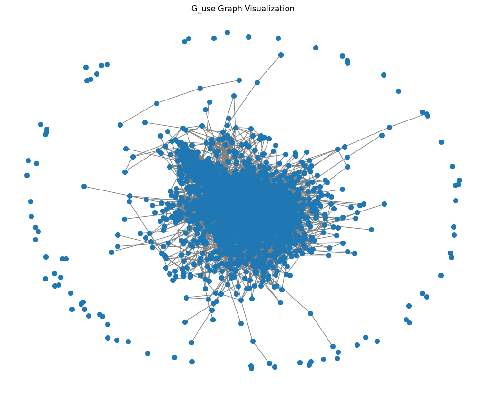

# Text Similarity Network Analysis

This project using graph theory to study embeddings models, namely: BERT, Universal Sentence Encoder (USE), and TF-IDF. It builds similarity graphs, computes graph metrics, and visualizes the results.

It also studies the different interpretations of eigenvalues coming from the graph networks for each fo the embeddings. Generallly, plotting embedding models of higher dimensions (512 or 300 dim) is impossible. That barrier is broken here by converting the embeddings to a graph network, where each news article is node and connection with cosine similarity greater 50 has an edge.

A detailed article can be found in [Can Graph Theory’s Eigenvalues Break the Internet’s Echo Chambers?](https://medium.com/data-science-collective/using-graph-theory-to-study-embedding-models-7dfa5c47e03d)

## Features

- Loads news summaries from the CNN/DailyMail dataset (CSV files in `data/cnn_dailymail/`).
- Generates sentence embeddings using:
  - BERT (`all-MiniLM-L6-v2`)
  - Universal Sentence Encoder (USE)
  - TF-IDF
- Computes cosine similarity matrices for each embedding.
- Builds similarity graphs using NetworkX.
- Calculates graph metrics: density, average clustering, top connected nodes.
- Finds top 6 most similar article pairs for each embedding.
- Computes and plots eigenvalues of adjacency matrices.
- Visualizes graphs using spring layout.

## Requirements

- Python 3.8+
- pandas
- numpy
- scikit-learn
- networkx
- matplotlib
- sentence-transformers
- huggingface_hub (if using USE via Keras)

Install dependencies:
This should be executed from folder with the toml file
```bash
uv sync
```

## Usage

1. Place the CNN/DailyMail dataset CSV files in `data/cnn_dailymail/` (e.g., `train.csv`, `test.csv`).
2. Edit `text_similarity.py` if you want to change which file or column is used.
3. Run the script:
   ```bash
   python text_similarity.py
   ```
4. The script will print graph metrics and show plots for eigenvalues and graph visualizations.

## Example Output

- Graph density and clustering for each embedding method.
- Top 10 news articles with highest connections in each graph.
- Top 6 most similar news pairs for each embedding.
- Plots comparing eigenvalues of the graphs.
- Visualizations of the similarity graphs.





## Customization

- Change the number of articles loaded by modifying the slicing in the code.
- Adjust the similarity threshold in `build_graph()` for sparser or denser graphs.
- Use different columns from the dataset (e.g., `highlights`, `article`).

## License

MIT License
